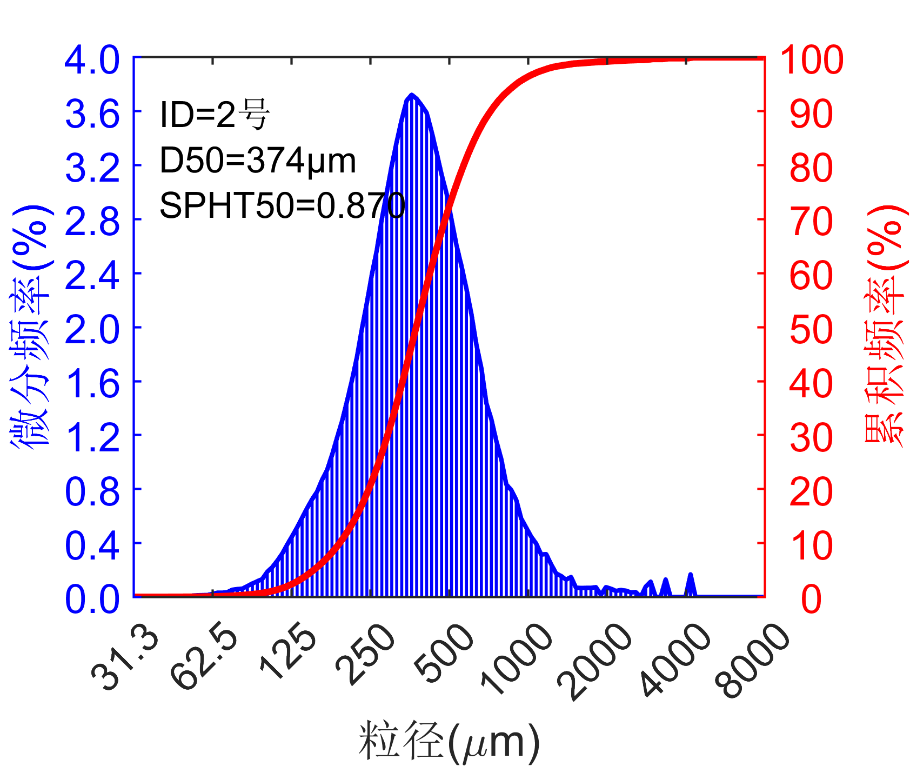
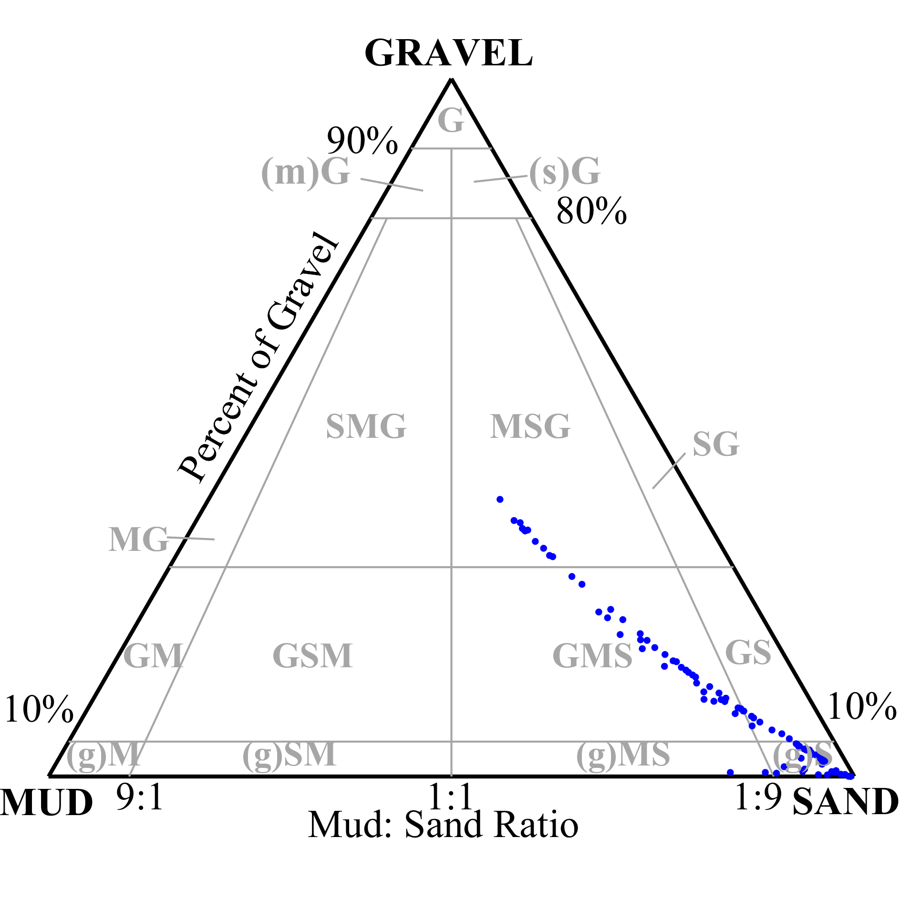
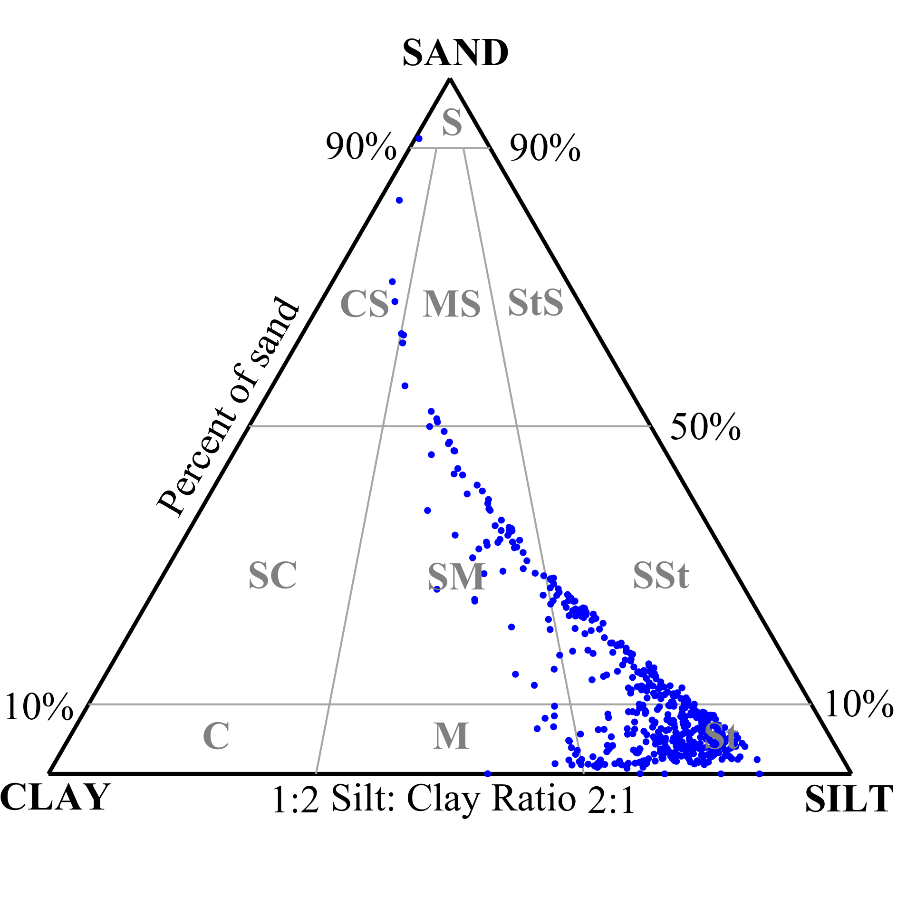

# GS-Package
A matlab package for processing sediment grain size and shape with support for LISST200X, Camsizer X2, Coulter LS, and Malvern Mastersizer 2000/3000 instruments.

GS-Package was originally developed to fulfill the research needs of SKLEC students in ECNU. It is hoped that GS-Package will help them to make fewer duplicate wheels and can make writing junk papers more enjoyable and convenient.

So, to make the SKLEC kids even cuter, please contact me for any bug fixes, feature upgrades, or questions. 

LAOLee's email: whli@sklec.ecnu.edu.cn
## Compatible Instruments
- Microtrac Cmasizer X2
- Coulter LS13320
- Coulter LS100
- Malvern MasterSizer 2000
- Malvern MasterSizer 3000
- Sequoia LISST200X
## Currently implemented functions
- output metadata report
- Characterization of particle size and shape
- output statistical parameters of the user-speicified components
- output particle grading curve figures in editable format
- output diagnostic triangular phase map following Folk(1954) and Blair-McPherson(1999) 
- Outputs data reports that can be imported into AnalySize software for end element analysis
methods in editable format
- Output reports in accordance with GB/T12763.8

## Statistical parameters of laboratory operation, particle size and shape
- ``instrumentId``: 
    - = ``1``, coulter LS Serials
    - =``11``, camsizer X2
    - =``21``, malvern MasterSizer Serials
    - =``31``, Sequoia LISST200X
- ``analysisTime``: Time to start on-board measurements(datetime)
- ``analysisPeriod``: measurement period(s)
- ``obscuration``: obscuration(%), only for laser diffraction method
- ``pumpSpeed``: pump speed, only for laser diffraction method
- ``SSa``: specific surface area, only for laser diffraction method
- ``waterRefractivity``: water refractivity, only for laser diffraction method
- ``particleRefractivity``: particle refractivity, only for laser diffraction method
- ``particleAbsorptivity``: particle absorptivity, only for laser diffraction method
- ``channelMidSize``: logarithmic midpoint size of the channel(um)
- ``adjustP3``: differential volume percentage after removal of invalid components (%)
- ``adjustQ3``: cumulative volume percentage after removal of invalid components (%)
- ``d05``:  5% of all particles are no larger than ``d05``, (um)
- ``d10``: 10% of all particles are no larger than ``d10``, (um)
- ``d16``: 16% of all particles are no larger than ``d16``, (um)
- ``d25``: 25% of all particles are no larger than ``d25``, (um)
- ``d50``: median size, 50% of all particles are no larger than ``d50``, (um)
- ``d75``: 75% of all particles are no larger than ``d75``, (um)
- ``d84``: 84% of all particles are no larger than ``d84``, (um)
- ``d90``: 90% of all particles are no larger than ``d90``, (um)
- ``d95``: 95% of all particles are no larger than ``d95``, (um)
- ``dm``: mean size(um)
- ``dm_Mcmanus``: mean size(phi), Mcmanus
- ``sigma_Mcmanus``: sorting, Mcmanus
- ``sk_Mcmanus``: skewness, Mcmanus
- ``kg_Mcmanus``: Kurtosis, Mcmanus
- ``dm_Folk1954``: mean size(um), GB/T12763.8
- ``sigma_Folk1954``: sorting, GB/T12763.8
- ``sk_Folk1954``: skewness, GB/T12763.8
- ``kg_Folk1954``: Kurtosis, GB/T12763.8
- ``sortingLevel``: sorting level(GBT 12763.8-2007)
  - =``1``, ``very good``,``sigma_Folk1954`` < 0.35 phi
  - =`2`, ``good``, 0.35 phi <= ``sigma_Folk1954`` < 0.71 phi
  - =`3`, ``middle``, 0.71 phi <= ``sigma_Folk1954`` < 1.00 phi
  - =`4`, ``bad``, 1.00 phi <= ``sigma_Folk1954`` < 4.00 phi
  - =`5`, ``very bad``, 4.00 phi <= ``sigma_Folk1954``
- `variance`: variance =sqrt(D84_phi/D16_phi)
- `gravel`: (2mm, inf], percentage
- `sand`: (63um,2mm], percentage
- `silt`: (3.9um,63um], percentage
- `clay`: (0,3.9um], percentage
- `classificationCode`: 
  - `gravel`>0: following Folk(1954) method, see folk1954.fig
  - `gravel`==0: following Blair-McPherson(1999) method, see BlairMcPherson1999.fig
- `classificationMethod`: 
  - =`Blair-McPherson1999`, `gravel`>0
  - =`Folk1954`  , `gravel`==0
- `upSize_GBT12763`: upper limit size of the channels which are defined in GBT12763, (um)
- `Q3_GBT12763`: cumulative volume percentage of the channels which are defined in GBT12763, (%)
- `depth`: water depth, only used in LISST 200X
- `temperature`: water depth, only used in LISST 200X
- `extADC2`: external ADC2, only used in LISST 200X
- `extADC3`: external ADC3, only used in LISST 200X
- `totalVolumeConcentration`: total volume concentration, only used in LISST 200X
- `opticalTransmission`: optical transmission, only used in LISST 200X
- `beamAttenuation`: beam attenuation, only used in LISST 200X
- `spht_50_2`: median of sphericity, inferred from the original exported accumulation curve of particle shape
- `spht_m_2`: mean of sphericity, inferred from the original exported accumulation curve of particle shape
- `b_l_50_2`: median of aspect ratio, inferred from the original exported accumulation curve of particle shape
- `b_l_m_2`: mean of aspect ratio, inferred from the original exported accumulation curve of particle shape
- `B_LRec_50_2`: median of minimum aspect ratio, inferred from the original exported accumulation curve of particle shape
- `B_LRec_m_2`: mean of minimum aspect ratio, inferred from the original exported accumulation curve of particle shape
- `symm_50_2`: median of symmetry, inferred from the original exported accumulation curve of particle shape
- `symm_m_2`: mean of symmetry, inferred from the original exported accumulation curve of particle shape
- `rdnsc_50_2`: median of roundness, inferred from the original exported accumulation curve of particle shape
- `rdnsc_m_2`: mean of roundness, inferred from the original exported accumulation curve of particle shape
- `conv_50_2`: median of convexity, inferred from the original exported accumulation curve of particle shape
- `conv_m_2`: mean of convexity, inferred from the original exported accumulation curve of particle shape
- `sigmav_50_2`: median of sigmav?, inferred from the original exported accumulation curve of particle shape
- `sigmav_m_2`: mean of sigmav?, inferred from the original exported accumulation curve of particle shape
- `spht_50`: median of sphericity, inferred from the grainsize indexed particle shape
- `spht_m`: mean of sphericity, inferred from the grainsize indexed particle shape
- `b_l_50`: median of aspect ratio, inferred from the grainsize indexed particle shape
- `b_l_m`: mean of aspect ratio, inferred from the grainsize indexed particle shape
- `B_LRec_50`: median of minimum aspect ratio, inferred from the grainsize indexed particle shape
- `B_LRec_m`: mean of minimum aspect ratio, inferred from the grainsize indexed particle shape
- `symm_50`: median of symmetry, inferred from the grainsize indexed particle shape
- `symm_m`: mean of symmetry, inferred from the grainsize indexed particle shape
- `rdnsc_50`: median of roundness, inferred from the grainsize indexed particle shape
- `rdnsc_m`: mean of roundness, inferred from the grainsize indexed particle shape
- `conv_50`: median of convexity, inferred from the grainsize indexed particle shape
- `conv_m`: mean of convexity, inferred from the grainsize indexed particle shape
- `sigmav_50`: median of sigmav?, inferred from the grainsize indexed particle shape
- `sigmav_m`: mean of sigmav?, inferred from the grainsize indexed particle shape
- `sfCorey_50`: median of Corey shape factor, sfCorey=xMa_min/sqrt(xFe_min*xFe_max), inferred from the grainsize indexed  particle shape
- `sfCorey_m`: mean of Corey shape factor, inferred from the grainsize indexed  particle shape
- `userComponent(nComponents)`: parameters of the user-specified components
  - `.upSize`: upper size of the user-specified components
  - `.downSize`: lower size of the user-specified components
  - `.fraction`: percentage of all
  - `.dm`: mean size in unit of um
  - `.dm_Mcmanus`: mean size in unit of phi(Mcmanus method)
  - `.sigma_Mcmanus`: sorting (Mcmanus method)
  - `.sk_Mcmanus`: skewness (Mcmanus method)
  - `.kg_Mcmanus`: Kurtosis (Mcmanus method)
  - `.spht_m`: mean of sphericity
  - `.symm_m`: mean of symmetry
  - `.b_l_m`: mean of aspect ratio
  - `.B_LRec_m`: mean of minimum aspect ratio
  - `.sigmav_m`: mean of sigmav?
  - `.conv_m`: mean of convexity
  - `.rdnsc_m`: mean of roundness
  - `.sfCorey_m`: mean of Corey shape factor
## References
- Bagheri, G. H., C. Bonadonna, I. Manzella, and P. Vonlanthen. “On the Characterization of Size and Shape of Irregular Particles.” Powder Technology 270 (January 1, 2015): 141–53. https://doi.org/10.1016/j.powtec.2014.10.015.
- Folk, R.L. and Ward, W.C. (1957) A Study in the Significance of Grain-Size Parameters. Journal of Sedimentary Petrology, 27, 3-26.https://doi.org/10.1306/74D70646-2B21-11D7-8648000102C1865D
- Li, Linzhu, and Magued Iskander. “Comparison of 2D and 3D Dynamic Image Analysis for Characterization of Natural Sands.” Engineering Geology 290 (September 5, 2021): 106052. https://doi.org/10.1016/j.enggeo.2021.106052.
- State market regulatory administration of P.R.C. "Specifications for oceanographic survey - Part 8: marine geology and geophysics survey (海洋调查规范 第8部分: 海洋地质地球物理调查.)" GB/T 12763.8-2007(2007).
- Terence C. Blair, John G. McPherson; Grain-size and textural classification of coarse sedimentary particles. Journal of Sedimentary Research 69 (1999): 6–19. https://doi.org/10.2110/jsr.69.6
## How to use GS-Package
- see `demo.m`
  all the settings are integrated in a structure variable "userSettings". 
- Definitions of "userSettings"
``userSettings.``
  - ``sampleSettingFileName``: sample settings information file
  - ``dataPath``: full path of the raw data files
  - ``outputPath``: full path of the output files
  - ``prefixString``: prefixes for archive file names
  - ``forceReadRawData``:
    - = ``true``, allways read data from raw files;
    - = ``false``, load the rawData.mat if exists in the dataPath; otherwise, read data from raw files
  - ``MIN_CHANNEL_SIZE_UM``: lower limit of instrument detection (um), should be greater than 0, default is 0.01um
  - ``MAX_CHANNEL_SIZE_UM``: upper limit of instrument detection (um), default is 10mm
  - ``GradationCurveFigWidth``: figure width of the gradation curve, in unit of cm
  - ``GradationCurveFigHeight``: figure height of the gradation curve, in unit of cm
  - ``language``: 
    - =``'cn'``, particle grading curves are labeled in Chinese;
    - =``'en'``, particle grading curves are labeled in English
  - ``userChannelSize``=``load('200ChannelOf8000.txt','-ascii')``, Specify uniform channel boundaries (samples are measured with several types of instruments with different channel-size definition), in um, example values [0.1,1,2,10:10:5000].
  - ``componentDownSize``: upper size of the user components (um)
  - ``componentUpSize``: lower size of the user components (um)
  - ``exportGBT12763``: output GBT12763-format report, =``true`` or ``false``
  - ``exportGradingCurve``: output particle grading curve figures, =``true`` or ``false``
  - ``exportMetadata``: output metadata report, =``true`` or ``false``
  - ``exportAllData``: output all the statistical parameters, =``true`` or ``false``
  - ``exportUserComponent``: output statistical parameters of the user-speicified components, =``true`` or ``false``
  - ``exportClassificationScheme``: output diagnostic triangular phase map, =``true`` or ``false``
## How to batch export text data in Mastersizer 2000/3000 software?
1. Edit menu>>User grainsize>>Edit grainsize: Load grainsize, select malvernGrainsize.siz
2. Copy malvernExportDataForGSPackage.edf to the following directory:
    - C:\Users\Public\Documents\Malvern Instruments\Mastersizer 2000\Export Templates
4. shift+left click of mouse button to select the data file >> File menu >> Export Data:
    - Use Data Templates = malvernExportDataForGSPackage
    - Format Options = Use tabs as separators, exclude header rows.
    - Export data to file, select text file (*.txt)
    - Check to overwrite files
    - Output filename suffixes only allowed as *.mal